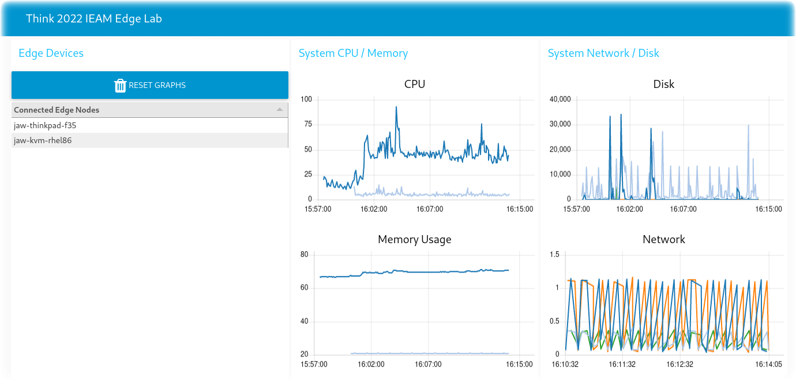

# IBM Edge Application Manager CPU Output to Watson IoT Platform

This repository builds a Docker containerized workload that can be deployed to
an edge node running the [Open Horizon](open-horizon.github.io/) agent. The workload can be configured as
a managed service and policy in IBM Edge Application Manager.  It queries
psutil CPU data periodically and sends the CPU results over MQTT to
Watson IoT Platform and plots the results in a chart.



### Prerequistes

- Docker installed
- IEAM Horizon agent installed

###

Begin by editing the variables at the top of the Makefile as desired. If you plan to push it to a Docker registry, make sure you give your docker ID. You may also want to create unique names for your **service** and **policy** (necessary if you are running a multi-tentant IEAM instance with other users and you are all publishing this service).

To play with this outside of Open Horizon:

```bash
make build
make run
...
make stop
```

When you are ready to try it inside Open Horizon:

```bash
docker login
make build
make push
make publish-service
make publish-policy
```

Once it is published, you can use:

```bash
make agent-run
watch hzn agreement list
...
```
